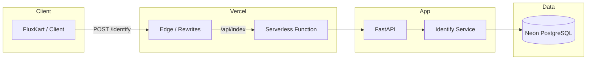

# Bitespeed Identify API

Contact identity resolution for FluxKart: link multiple emails/phones to one customer and return a consolidated view.

---

## Live API

| | |
|---|---|
| **Base URL** | `https://bitespeed-identifier-rhishikesh-bansodes-projects.vercel.app` |
| **Identify** | `POST /identify` |

**Request (JSON body):** `{ "email"?: string, "phoneNumber"?: number \| string }`  
**Response:** `{ "contact": { "primaryContatctId", "emails", "phoneNumbers", "secondaryContactIds" } }`

---

## Architecture



**Tech stack**

| Layer | Technology |
|-------|------------|
| Hosting | Vercel (serverless) |
| API | FastAPI (Python) |
| Validation | Pydantic |
| DB | PostgreSQL (Neon), SQLAlchemy |
| Local DB | SQLite (default) |

---

## Project structure

```
├── api/
│   └── index.py          # Vercel serverless entry (wires FastAPI)
├── app/
│   ├── main.py           # FastAPI app, lifespan, routes
│   ├── database.py       # SQLAlchemy engine, get_db
│   ├── models.py         # Contact model
│   ├── schemas.py        # Pydantic request/response
│   ├── identify_service.py
│   └── routers/
│       └── identify.py   # POST /identify
├── vercel.json           # Rewrites → /api/index
├── requirements.txt
└── .env.example
```

---

## Setup

```bash
python3 -m venv .venv
source .venv/bin/activate
pip install -r requirements.txt
cp .env.example .env   # optional: set DATABASE_URL, PORT
uvicorn app.main:app --reload --port 8000
```

**Env:** `DATABASE_URL` (default: SQLite `./dev.db`; production: PostgreSQL). `PORT` (default 8000).

---

## Deploy (Vercel)

1. Import repo on [Vercel](https://vercel.com/new).
2. **Storage** → Create Database → **Neon** (PostgreSQL). `DATABASE_URL` is set automatically.
3. **Deployments** → Redeploy.
4. **Settings** → **Deployment Protection** → Production → **None** (so the API is public).

---

## Test

```bash
curl -X POST https://bitespeed-identifier-rhishikesh-bansodes-projects.vercel.app/identify \
  -H "Content-Type: application/json" \
  -d '{"email":"test@example.com","phoneNumber":"123456"}'
```
