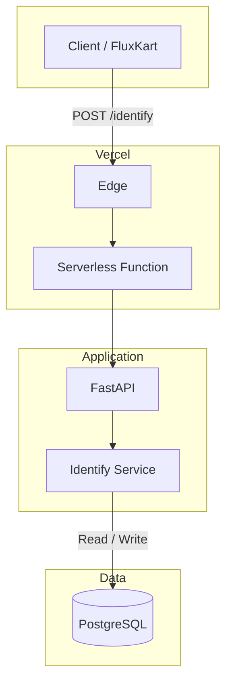

# Bitespeed Identify API

A contact identity resolution service for **FluxKart**: it links multiple emails and phone numbers to a single customer and returns one consolidated contact view.

---

## What this project does

FluxKart uses **Bitespeed** to collect contact details (email, phone) for a personalised experience. The same person may place orders with different emails or numbers. This API:

- **Identifies** whether an incoming email/phone belongs to an existing customer or a new one.
- **Links** contacts that share at least one identifier (same email or same phone), so they are treated as one customer.
- **Returns** a single consolidated contact: one primary contact, all linked emails and phone numbers, and any secondary contact IDs.

So no matter which email or phone someone uses, FluxKart sees one unified customer.

---

## Special functionality

- **Primary vs secondary contacts**  
  The first contact created for a customer is the *primary*; any later contacts that link to it (via shared email or phone) are *secondary* and point to the primary.

- **Automatic linking**  
  If a request matches an existing contact on email or phone, the service either returns that chain or creates a new secondary when the request brings a *new* email or phone.

- **Merging two primaries**  
  When the same person is represented by two separate primary contacts (e.g. one found by email, one by phone), the service merges them: the older primary stays, the newer one becomes a secondary linked to it.

- **Single source of truth**  
  All requests that relate to the same person (by shared email or phone) get the same consolidated response: same `primaryContatctId`, same `emails` and `phoneNumbers` lists, same `secondaryContactIds`.

---

## Live API

| | |
|---|---|
| **Base URL** | `https://bitespeed-identifier-rhishikesh-bansodes-projects.vercel.app` |
| **Identify** | `POST /identify` |

**Request (JSON body):** `{ "email"?: string, "phoneNumber"?: number \| string }`  
**Response:** `{ "contact": { "primaryContatctId", "emails", "phoneNumbers", "secondaryContactIds" } }`

---

## Architecture



**Tech stack**

| Layer | Technology |
|-------|------------|
| Hosting | Vercel (serverless) |
| API | FastAPI (Python) |
| Validation | Pydantic |
| Database | PostgreSQL (Neon), SQLAlchemy |
| Local dev | SQLite (optional) |

---

## Project structure

```
├── api/index.py          # Vercel entry → FastAPI app
├── app/
│   ├── main.py           # FastAPI app, routes, lifespan
│   ├── database.py       # Engine, session, get_db
│   ├── models.py         # Contact model
│   ├── schemas.py        # Request/response schemas
│   ├── identify_service.py   # Linking & consolidation logic
│   └── routers/identify.py   # POST /identify
├── vercel.json           # Rewrites to /api/index
└── requirements.txt
```
